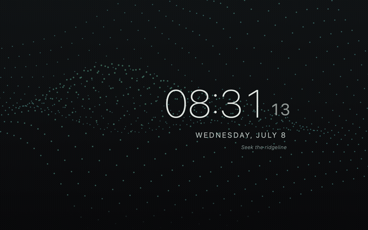
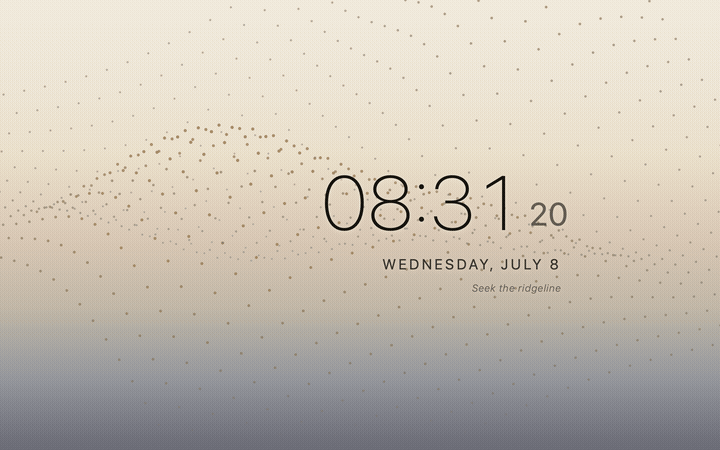

# Manifold — a macOS screensaver & live wallpaper

[](https://github.com/IngTian/manifold-screensaver/actions/workflows/build.yml)
[](LICENSE)


> *「聖人含道映物，賢者澄懷味象。」*
> *The sage embodies the Way and mirrors things; the wise clarify the mind and savor forms.*
> — 宗炳《畫山水序》, Zong Bing, *Preface on Landscape Painting* (c. 400 CE)

A minimal digital clock floating over a living **pointillist 3D terrain** — a
mountain rendered as breathing points of light. Ported faithfully from the hero
animation on [ingtian.github.io](https://ingtian.github.io).

*Manifold* — the terrain is literally a 2-manifold surface; the name also nods to
manifold optimization and to many-folded mountain ranges (山水).

<p align="center">
  
  
</p>

The terrain is a Gaussian-bump elevation field sampled on a 33×33 grid, projected
through a fixed yaw+tilt rotation and drawn as ~1000 elevation-colored dots. The
field breathes slowly, and glowing "walker" particles periodically trace
gradient-descent paths downhill and settle with a soft glow. Colors (sky gradient,
elevation ramp, walker glow) are the exact values from the site's `SkyWash.css`
and `terrain.js`, for both light and dark themes — and switching themes **cross-fades**
smoothly (a slow dawn/dusk transition) rather than snapping.

## Install

**Requirements:** macOS 14+ and the Xcode **Command Line Tools** (no full Xcode).
If you don't have them: `xcode-select --install`.

Because you build it **locally**, macOS doesn't quarantine it — there's no
"unidentified developer" wall and no Apple Developer account needed.

There are two pieces and you can install either or both. The one-command
installer takes a `screensaver` (default), `wallpaper`, or `all` argument:

```sh
# Screen saver only (default):
curl -fsSL https://raw.githubusercontent.com/IngTian/manifold-screensaver/main/scripts/install.sh | bash

# Live wallpaper only:
curl -fsSL https://raw.githubusercontent.com/IngTian/manifold-screensaver/main/scripts/install.sh | bash -s -- wallpaper

# Both:
curl -fsSL https://raw.githubusercontent.com/IngTian/manifold-screensaver/main/scripts/install.sh | bash -s -- all
```

*(The `-s --` passes the argument through to the piped script.)*

**Or from a clone:**

```sh
git clone https://github.com/IngTian/manifold-screensaver.git
cd manifold-screensaver
scripts/install.sh            # screensaver (default)
scripts/install.sh wallpaper  # live wallpaper
scripts/install.sh all        # both
```

The screen saver installs to `~/Library/Screen Savers/Manifold.saver`; the
wallpaper installs to `/Applications/Manifold Wallpaper.app` and launches
immediately. See **[Configuring & using](#configuring--using)** below to turn
them on and tune them.

> If the screen saver doesn't show up in System Settings right away, force a
> re-scan: `killall WallpaperAgent legacyScreenSaver 2>/dev/null || true`

### Manual build (without installing)

```sh
scripts/build.sh                    # build/Manifold.saver (universal)
scripts/build.sh install            # …and copy to ~/Library/Screen Savers
scripts/build-wallpaper.sh          # build/Manifold Wallpaper.app (universal)
scripts/build-wallpaper.sh install  # …and copy to /Applications + launch
```

## Updating

Re-run the same installer — it fetches the latest source, rebuilds, and
overwrites the installed copy in place. Your settings are **not** touched (they
live in preference stores, not in the app):

```sh
# Update whatever you have installed (pick the matching component):
curl -fsSL https://raw.githubusercontent.com/IngTian/manifold-screensaver/main/scripts/install.sh | bash -s -- all
```

- **Screen saver:** the installer nudges the settings UI to reload; if a preview
  looks stale, close and reopen the Screen Saver pane (or
  `killall WallpaperAgent legacyScreenSaver`).
- **Live wallpaper:** the installer quits the running copy, replaces the app, and
  relaunches it automatically — no logout needed.

From a clone, `git pull` first, then re-run `scripts/install.sh <component>`.

## The live wallpaper

The same terrain can also run as a **live desktop wallpaper** — the breathing
mountain behind your icons, with an animated light↔dark cross-fade. It's a tiny
background app (`Manifold Wallpaper.app`) that shares the exact renderer with the
screen saver. No clock by design — a calm backdrop rather than a second clock
competing with your menu bar.

**Why a separate app?** macOS exposes no public API for animated wallpapers, so —
like every third-party live wallpaper (Plash, etc.) — it pins its own borderless
window at the desktop level (above the static wallpaper, below your icons). Because
it never touches the screensaver subsystem, it's unaffected by MDM screensaver
policies. It's **battery-aware**: 30 fps normally, 15 fps on battery / Low Power
Mode, and it fully pauses (≈0 % CPU) whenever the desktop is covered, the display
sleeps, the screen is locked, or the real screensaver runs.

## Configuring & using

The two pieces are configured in **two different places** — the screen saver
through System Settings (macOS only knows about `.saver` bundles there), the
wallpaper through its own menu-bar icon (it's a standalone app). Both remember
their settings across restarts and updates.

### The screen saver — System Settings → Options…

1. **Turn it on:** System Settings → **Screen Saver** → scroll down to the
   **"Other"** group → pick **Manifold**. Set the idle timer under
   **Lock Screen → "Start Screen Saver when inactive"**.
2. **Configure it:** click **Options…** on the Manifold tile. Settings persist via
   `ScreenSaverDefaults` and take effect immediately in the preview:

   - **24-hour time** (default on) — `14:32` vs `2:32 pm`
   - **Show seconds** (default on) — small superscript seconds that tick
   - **Show date** (default on) — spaced-caps weekday + date under the time
   - **Show walker particles** (default **off**) — the glowing downhill walkers
   - **Theme** — Auto (match system) / Light / Dark
   - **Font** — System (SF Pro) / Rounded / Serif (New York) / Monospace
   - **Motto** — a small italic signature line below the clock, right-aligned to
     the date (default `Lorem Ipsum`). Any text works, including pasted Unicode
     such as Greek letters (α, β, σ, …); leave empty to hide.

   The clock sits on the horizontal golden section (≈61.8 % of width), balancing
   the terrain's ridge on the left.

### The live wallpaper — the ⛰ menu-bar icon

Once installed, the app runs in the background and shows a **⛰ icon in the menu
bar** (top-right). Everything is configured from that menu — there's no System
Settings entry, because it's an app, not a `.saver`:

- **Theme** — Auto (match system) / Light / Dark (switches cross-fade smoothly)
- **Walker particles** — toggle the glowing downhill walkers
- **Pause on battery** — fully stop animating on battery (default off; it already
  drops to 15 fps and pauses when hidden regardless)
- **Show message** — toggle the bottom-left signature line
- **Set message…** — edit that line's text (editing it turns it on). Default
  `Lorem Ipsum`; paste any Unicode you like. It sits at the lower-left golden
  section and cross-fades with the theme.
- **Launch at login** — start the wallpaper automatically at login
- **Quit Manifold Wallpaper** — stop it (removes the desktop window)

> *Launch at login* uses `SMAppService`, which wants a stably-located, signed app —
> that's why the installer puts it in `/Applications`. If the toggle ever fails on
> an ad-hoc build the app still runs; enable it manually in **System Settings →
> General → Login Items**.

## The math

The scene is a small amount of closed-form math, ported verbatim from
[`terrain.js`](https://ingtian.github.io) into
[`TerrainRenderer.swift`](Sources/TerrainRenderer.swift). Here's the whole thing.

**Elevation field.** The terrain is a sum of $M = 5$ Gaussian bumps over the
plane $(x, y)$, scaled by $U = 1.7$:

$$
h(x, y) \;=\; U \sum_{k=1}^{M} a_k \,
\exp\!\left( -\frac{(x - c_{k,x})^2 + (y - c_{k,y})^2}{2\,\sigma_k^2} \right)
$$

Each bump $k$ has amplitude $a_k$ (signed — negative bumps carve valleys), center
$(c_{k,x}, c_{k,y})$, and spread $\sigma_k$. The field is sampled on a square grid
$x, y \in [-N, N]$ with step $V$ ($N = 2.6,\ V = 0.16$), giving
$\left(\lfloor 2N/V \rfloor + 1\right)^2 = 33 \times 33 = 1089$ points.

**Gradient.** Walkers flow downhill along $-\nabla h$, which has a closed form
(each bump contributes its own Gaussian times a linear factor):

$$
\frac{\partial h}{\partial x} = -U \sum_{k=1}^{M}
a_k \, \frac{x - c_{k,x}}{\sigma_k^2}\,
\exp\!\left( -\frac{(x - c_{k,x})^2 + (y - c_{k,y})^2}{2\,\sigma_k^2} \right)
$$

and symmetrically for $\partial h / \partial y$.

**Breathing.** Each frame the elevation is perturbed by a slow travelling wave in
time $t$ (seconds), so the surface gently swells and settles:

$$
z(x, y, t) \;=\; h(x, y) \;+\; A \, \sin\!\big( \omega t + 0.7\,x + 0.6\,y \big),
\qquad A = 0.04,\ \ \omega = 0.4
$$

**Projection.** Each point $(x, y, z)$ is rotated by a fixed yaw $\theta = 0.18\pi$
about the vertical axis, then tilted by $\phi = 0.92$ rad, and orthographically
projected to the screen:

$$
\begin{aligned}
u &= x\cos\theta - y\sin\theta, &\quad
d &= x\sin\theta + y\cos\theta, \\
p &= d\cos\phi - z\sin\phi, &\quad
\text{depth} &= d\sin\phi + z\cos\phi.
\end{aligned}
$$

With a scale factor $f = 0.34 \cdot \max\!\big(\min(W, H),\ 0.46\,W\big)$ (the
$\max$ is the ultra-wide fill — a uniform zoom, never a stretch), the on-screen
position is $\big(\tfrac{W}{2} + u f,\ 0.46\,H - p f\big)$. Points are painted
back-to-front by `depth`, and colored by a normalized elevation
$\ell = \operatorname{clamp}\big((z + J)/2J,\ 0, 1\big)$ (with $J = 1.55$) that
drives both the dot's color ramp and its radius/opacity.

**Walkers.** The glowing particles are literally gradient descent: from a fixed
start $(x_0, y_0)$, iterate $\mathbf{p}_{i+1} = \mathbf{p}_i - \eta\,\nabla h(\mathbf{p}_i)$
with step $\eta = 0.16$ until $\lVert \nabla h \rVert < 0.01$ (a local minimum), then
resample the path to 10 points and animate it tracing downhill. It's the same
descent a first-order optimizer walks — the "manifold" the name nods to.

## Display adaptability

Everything in the scene is sized as a **fraction of the view** — no hardcoded
pixels — so it scales to any resolution or Retina scale factor. Verified on 16:9,
21:9, 32:9 super-ultrawide, and portrait. On screens wider than ~21:9 the terrain
grows toward the width (a uniform zoom, never a stretch) so it fills the display
instead of leaving empty side margins.

## Layout

```
Sources/
  Palette.swift          SkyWash gradient + elevation ramps + walker colors (light/dark)
                           + palette blending for the theme cross-fade   [shared]
  TerrainRenderer.swift  Core Graphics port of terrain.js (field, projection, walkers)
                           + the animated theme cross-fade state machine  [shared]
  Settings.swift         ScreenSaverDefaults-backed options + FontDesign/ThemePreference
  ManifoldView.swift     ScreenSaverView principal class (draw, layout, config sheet)
  ConfigSheet.swift      Programmatic AppKit options sheet
  WallpaperApp/          The live-wallpaper agent app (reuses the two [shared] files):
    main.swift             accessory-app entry point
    AppDelegate.swift      per-display windows, status-bar menu, theme, launch-at-login
    WallpaperWindow.swift  borderless NSWindow pinned at the desktop level
    TerrainWallpaperView.swift  layer-backed view, CADisplayLink frame pacing
    PlaybackGovernor.swift particle/battery/occlusion/sleep/lock pause logic
    WallpaperSettings.swift  UserDefaults-backed options (own suite, no ScreenSaver dep)
Resources/
  Info.plist             NSPrincipalClass = ManifoldView (the .saver)
  Wallpaper-Info.plist   LSUIElement agent app (the wallpaper)
  thumbnail.png/@2x      System Settings preview image (a real rendered frame)
scripts/
  build.sh               swiftc → universal .saver bundle (+ optional install)
  build-wallpaper.sh     swiftc → universal "Manifold Wallpaper.app" (+ optional install)
  install.sh             one-command clone + build + install
                           (arg: screensaver | wallpaper | all; also the updater)
tools/
  render_frames.swift    Headless verifier: loads the real .saver and renders PNGs
```

## Publishing / forking

This is distributed as **source you build locally**, which is the friction-free
path for a free, open-source macOS screensaver: locally-built bundles aren't
quarantined by Gatekeeper, so no Apple Developer account, code-signing identity,
or notarization is required. Your friends just run `scripts/install.sh`.

If you fork it, update `REPO_URL` in [`scripts/install.sh`](scripts/install.sh)
and the bundle id `com.ingtian.manifold` (in
[`Resources/Info.plist`](Resources/Info.plist) and
[`scripts/build.sh`](scripts/build.sh)) to your own namespace.

**If you ever want it distributed as a signed, download-and-double-click bundle**
(so users don't build it themselves), that requires the paid Apple Developer
Program ($99/yr): sign with a Developer ID and notarize —
`codesign --options runtime --sign "Developer ID Application: …"` then
`xcrun notarytool submit … --wait` and `xcrun stapler staple`. Not needed for the
build-locally flow above.

## Verifying rendering headlessly

[`tools/render_frames.swift`](tools/render_frames.swift) loads the built bundle
exactly as the screensaver host does (`init(frame:isPreview:)` on
`NSPrincipalClass`) and captures frames — also used to generate the thumbnail:

```sh
SDK="$(xcrun --show-sdk-path)"
swiftc -sdk "$SDK" -framework AppKit -framework ScreenSaver \
  tools/render_frames.swift -o build/render_frames
mkdir -p build/frames
THEME=dark  ./build/render_frames build/Manifold.saver build/frames 1600 1000
THEME=light ./build/render_frames build/Manifold.saver build/frames 1600 1000
```

## Notes

- Fidelity: grid density (1089 pts), projection matrix, color ramps, breathing,
  and walker timing are copied verbatim from `terrain.js` so the aesthetic matches
  the site. The device-pixel-ratio (`g`) factor is omitted deliberately —
  Core Graphics applies the backing scale itself, so point-space drawing is
  equivalent.
- The bundle is ad-hoc code-signed, which is exactly right for the build-locally
  flow. See **Publishing / forking** above for the notarized-distribution path.

## License

[MIT](LICENSE) © Ing Tian (Zeying Tian). Terrain aesthetic after
[ingtian.github.io](https://ingtian.github.io).
